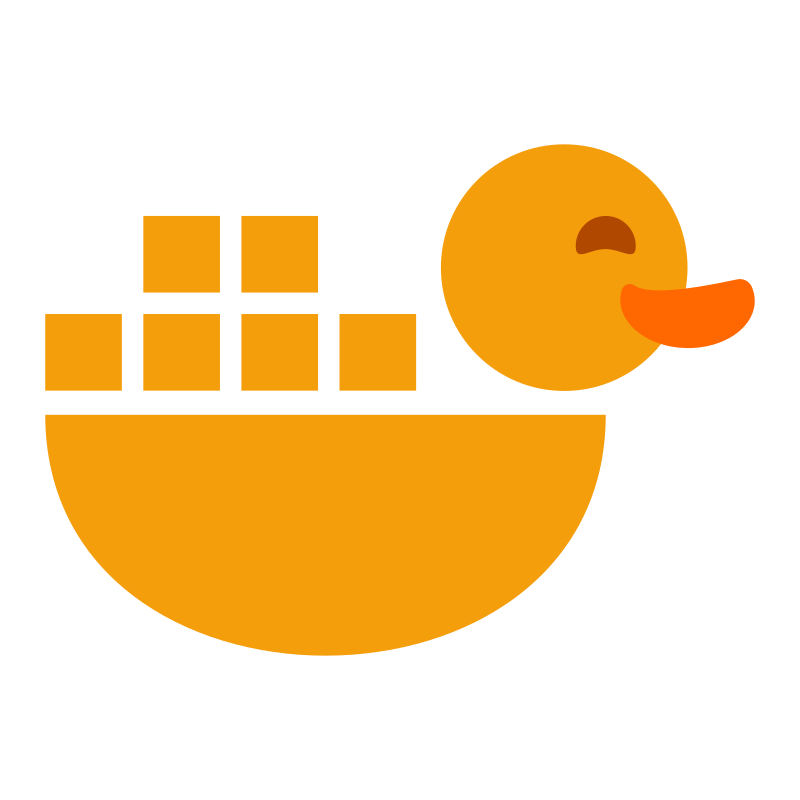

  
  <h1 align="center">Ducker Dashboard</h1>
  

    Keep your ducks in a row
  

## Setup
1. Copy `docker.compose.example.yml` to `docker-compose.yml`
2. In `docker-compose.yml`, modify the network `name` to whatever network your reverse proxy wants ducker to be on.
3. Modify `.env` with your values **(NOT YET IMPLEMENTED)**
4. `docker compose up -d`
5. `docker exec [your_ducker_container] ducker migrate`
6. `docker exec [your_ducker_container] ducker create-admin [email] [password]`
7. Lastly, point your reverse proxy to ducker at port `8080`
8. Done!

## Screenshots (WIP, to be updated)

